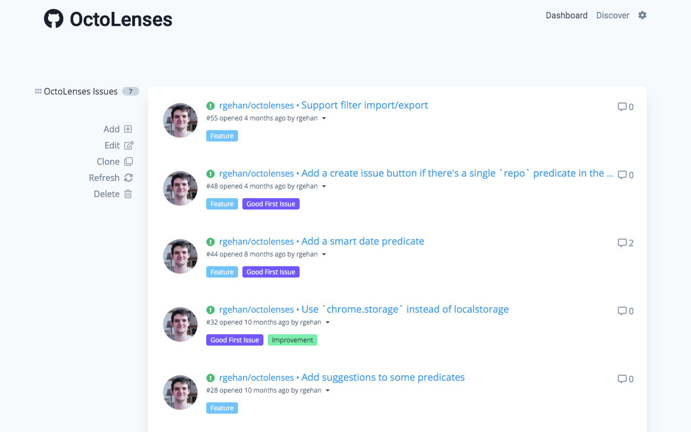
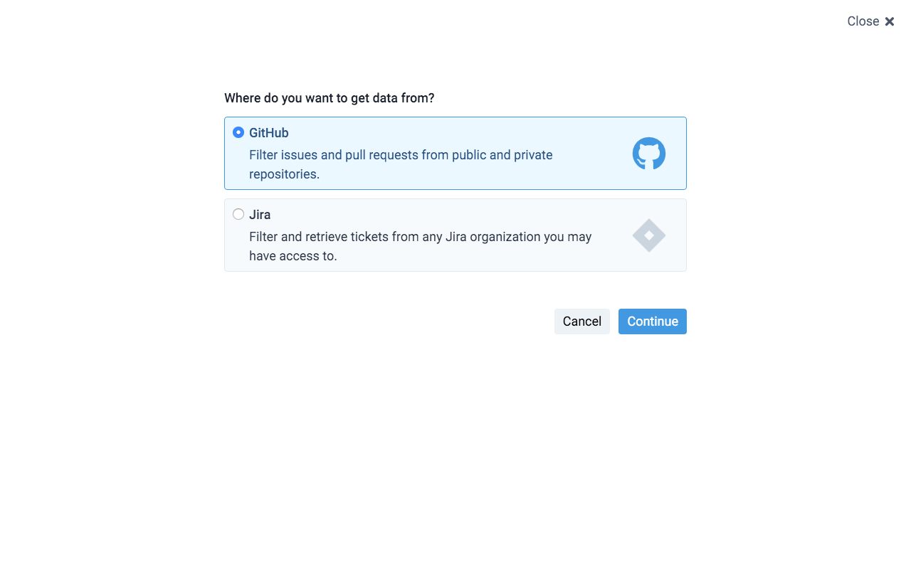
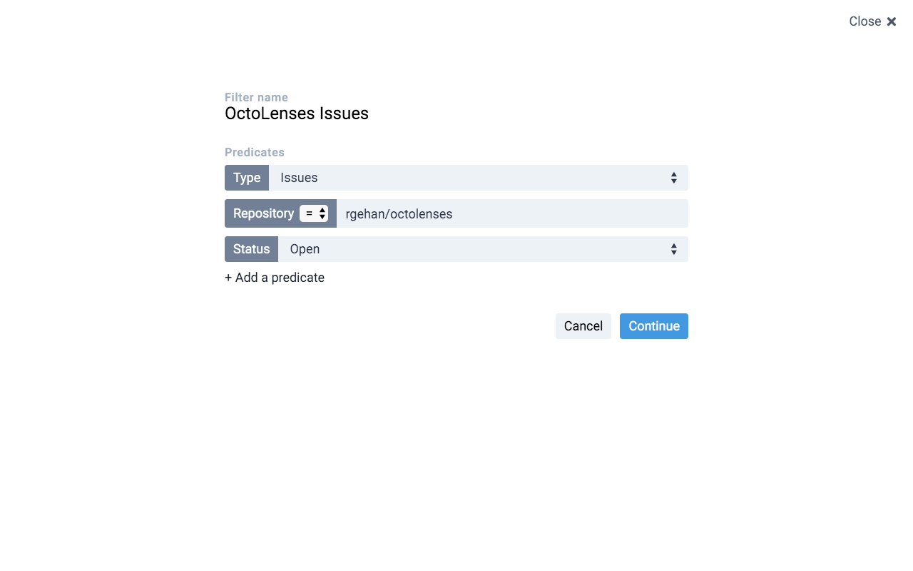
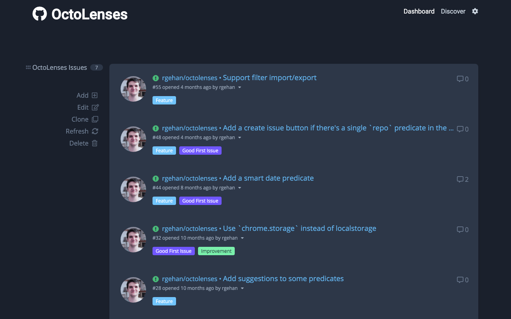
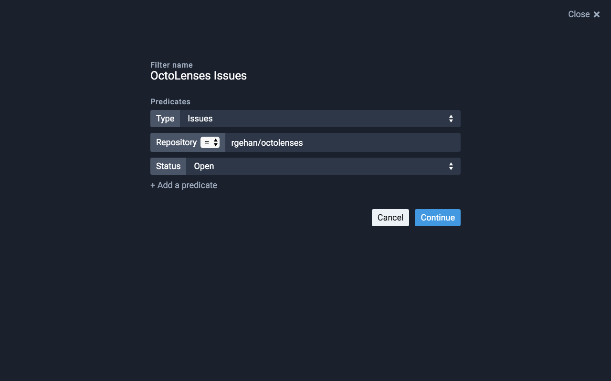
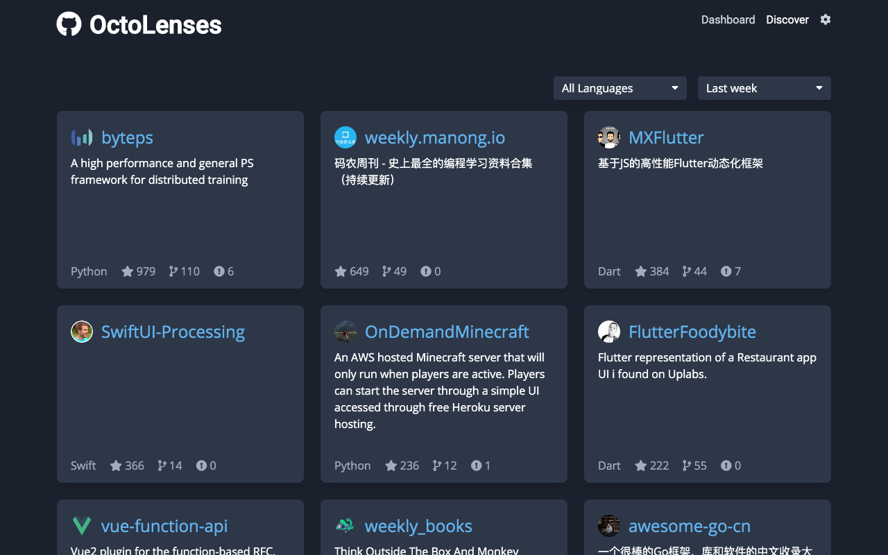
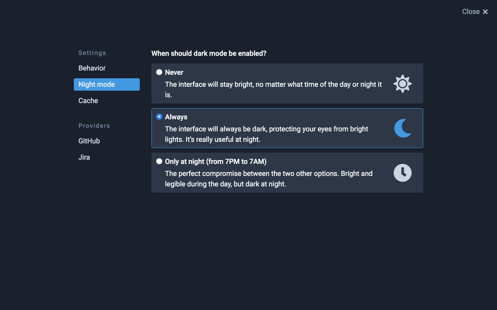
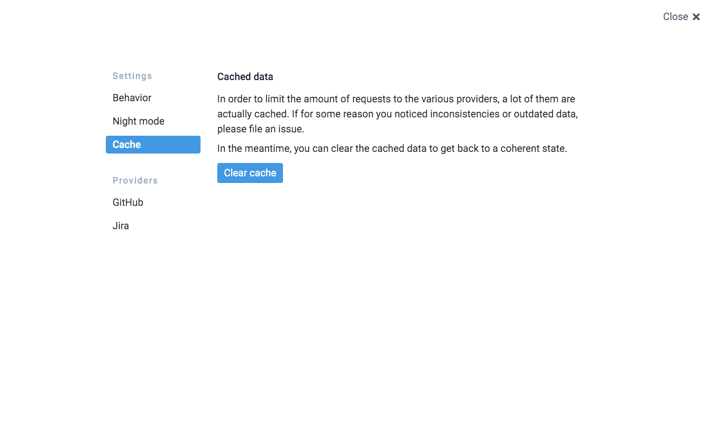
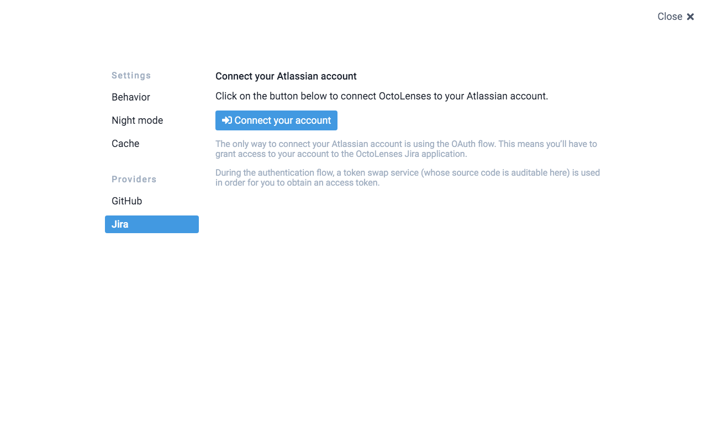

[](https://chrome.google.com/webstore/detail/octolenses/ghlblfakaklgkdmfejdlffbmpcaidoci)
[](https://addons.mozilla.org/firefox/addon/github-octolenses/)


# OctoLenses Browser Extension

> Watch your repos and discover awesome things directly from your New Tab page.

As a developer, you shouldn't have to worry about that and instead focus on what
is fundamental: your code

This extension allows you to create very precise filters that will nicely lay
out all the information you need in order to be as productive as possible.







## Installation

[](https://chrome.google.com/webstore/detail/octolenses/ghlblfakaklgkdmfejdlffbmpcaidoci)
[](https://addons.mozilla.org/firefox/addon/github-octolenses/)

Simply download it on your favorite browser's extensions store.

It is available on both [Google Chrome](https://chrome.google.com/webstore/detail/octolenses/ghlblfakaklgkdmfejdlffbmpcaidoci) and [Firefox](https://addons.mozilla.org/firefox/addon/github-octolenses/).

By default, it overrides your browser's default "New Tab" page, but this can be
disabled so that it only opens when you click on the extension's icon.

You can access this setting in the settings modal, which can be opened by
simply clicking on the little cog icon on the top right hand corner.

## Usage example

At my current job, we have quite a lovely system where each Pull Request is
assigned a specific label depending on whether it's a WIP, under review or
if it has been successfully (or not) reviewed.

I built this tool for the very purpose of keeping track of this, but this is not
all it can do. It can do much more, such as:

- Helping you contribute to Open Source by presenting you with issues that are
  labelled `Good first issue` or `Help wanted`
- Helping you stay up to date with your favorite framework changes
- Allowing you to discover trendy repositories in your favorite language
  (similar to what [GitHunt](https://github.com/kamranahmedse/githunt) does)

## Dark theme

Because being flashed bright lights in the eyes at night is the worst thing
ever, I even included a pretty cool dark mode.









## Extensively configurable

There are a lot of settings you can tweak, to adapt the experience of the
extension to your needs.






## Permissions asked

OctoLenses only asks for the `tabs` permission, as it needs to be able to:

- Detect when a tab is opened so it can eventually override it
- Create a new tab when the extension's icon is clicked.

## Development setup

You need a few tools before being able to build the extension:

- `yarn`, a [JS package manager](https://yarnpkg.com/docs/install) (on Mac: `brew install yarn`)
- `jq`, a [JSON CLI utility](https://stedolan.github.io/jq/) (on Mac: `brew install jq`).
- `sed`, should be available on any Unix system.
- `zip`, should be available on any Unix system.

Then you can follow this process to develop/build the extension:

```sh
# Clone the repository
git clone git@github.com:rgehan/octolenses.git && \
cd octolenses

# Install the dependencies
yarn

# Run the development environment...
yarn start

# ...or build the extension
yarn build
```

The built extension (located in the `dist/` folder), can then be loaded inside
your browser as an _unpacked extension_, provided you're in developer mode.

[https://github.com/rgehan/octolenses](rgehan/octolenses)

## Testing

The extension is covered by unit tests, and integration tests.

Here is how you can run them:
```bash
# Run the unit tests (w/ Jest)
yarn test

# Open the integration tests runner (w/ Cypress)
CYPRESS_GITHUB_TOKEN=<github token> yarn e2e
```

## Releasing

```sh
# Update changelog, increment version number & create release commit and tag
yarn release patch|minor|major

# Build the release .zip archive
yarn build
```

The archive can then be uploaded on the Chrome Store dashboard.

## Contributing

1. Fork it (<https://github.com/rgehan/octolenses/fork>)
2. Create your feature branch (`git checkout -b feature/fooBar`)
3. Commit your changes (`git commit -am 'Add some fooBar'`)
4. Push to the branch (`git push origin feature/fooBar`)
5. Create a new Pull Request

## License

MIT © Renan GEHAN
