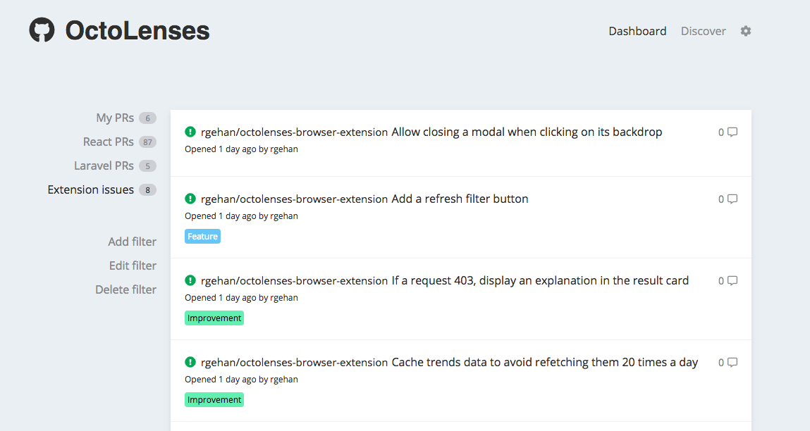
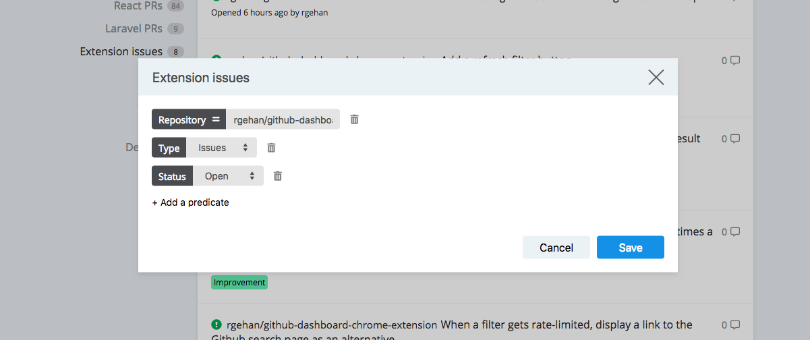

# OctoLenses Browser Extension

> Watch your repos and discover awesome things directly from your New Tab page.

As a developer, you shouldn't have to worry about that and instead focus on what
is fundamental: your code

This extension allows you to create very precise filters than will nicely lay
out all the information you need in order to be as productive as possible.





## Installation

This section is a work in progress.

## Usage example

At my current job, we have quite a lovely system where each Pull Request is
assigned a specific label depending on whether it's a WIP, under review or
if has been successfully (or not) reviewed.

I built this tool for the very purpose of keeping track of this, but this is not
all it can do. It can do much more, such as:

- Helping you contribute to Open Source by presenting you with issues that are
  labelled `Good first issue` or `Help wanted`
- Helping you stay up to date with your favorite framework changes
- Allowing you to discover trendy repositories in your favorite language
  (similar to what [GitHunt](https://github.com/kamranahmedse/githunt) allows)

## Development setup

```sh
# Clone the repository
git clone git@github.com:rgehan/octolenses-browser-extension.git && \
cd octolenses-browser-extension

# Install the dependencies
yarn

# Run the development environment...
yarn start

# ...or build the extension
yarn build
```

The built extension (located in the `dist/` folder), can then be loaded inside
your browser as an _unpacked extension_, provided you're in developer mode.

[https://github.com/rgehan/octolenses-browser-extension](rgehan/octolenses-browser-extension)

## Contributing

1. Fork it (<https://github.com/rgehan/octolenses-browser-extension/fork>)
2. Create your feature branch (`git checkout -b feature/fooBar`)
3. Commit your changes (`git commit -am 'Add some fooBar'`)
4. Push to the branch (`git push origin feature/fooBar`)
5. Create a new Pull Request

## License

MIT © Renan GEHAN
